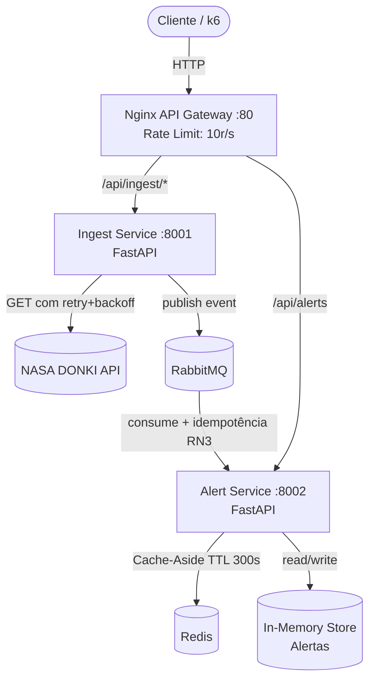

# Solar Shield — Sistema de Monitoramento de Clima Espacial

Sistema de microsserviços que ingere dados reais da NASA (DONKI), classifica riscos de clima espacial e dispara alertas para operadores de infraestrutura crítica.

---

## Arquitetura



### Serviços

| Serviço | Porta | Responsabilidade |
|---|---|---|
| **ingest-service** | 8001 | Busca dados na NASA, publica no RabbitMQ com retry+backoff |
| **alert-service** | 8002 | Consome fila, classifica severidade (RN1), aplica idempotência (RN3) |
| **nginx** | 80 | API Gateway, proxy reverso, rate limiting (10 req/s) |
| **rabbitmq** | 5672/15672 | Mensageria assíncrona entre serviços |
| **redis** | 6379 | Cache-Aside para GET /alerts |

---

## Regras de Negócio

**RN1 — Severidade de tempestade geomagnética:**
- Kp ≤ 4 → `"low"` | `emergencyNotification: false`
- 5 ≤ Kp ≤ 7 → `"moderate"` | `emergencyNotification: false`
- Kp ≥ 8 → `"severe"` | `emergencyNotification: true`

**RN3 — Idempotência:**
- Eventos com mesmo `event_id` recebidos mais de uma vez são descartados.
- Um log de duplicata é registrado: `DUPLICATE EVENT DISCARDED: event_id=...`

---

## TTL do Cache Redis

**TTL = 300 segundos (5 minutos)**

Justificativa: Dados de tempestades geomagnéticas (GST) da NASA são atualizados com intervalos mínimos de horas. Um TTL de 5 minutos garante resposta rápida para leituras frequentes enquanto mantém os dados razoavelmente atualizados, sem causar leituras obsoletas relevantes para o negócio.

---

## Pré-requisitos

- [Docker](https://docs.docker.com/get-docker/) e [Docker Compose](https://docs.docker.com/compose/install/)
- [k6](https://grafana.com/docs/k6/latest/get-started/installation/) (para smoke test)
- [Python 3.11+](https://www.python.org/) (para testes unitários locais)

---

## Execução

### 1. Subir toda a infraestrutura

```bash
# Opcional: usar sua chave NASA (gratuita em api.nasa.gov)
export NASA_API_KEY=DEMO_KEY

docker-compose up --build
```

> **Aguarde** todos os serviços ficarem healthy. RabbitMQ e Redis têm healthchecks configurados.

### 2. Disparar ingestão de dados da NASA

```bash
# Busca eventos GST dos últimos 30 dias
curl -X POST "http://localhost/api/ingest/gst"

# Com datas específicas
curl -X POST "http://localhost/api/ingest/gst?start_date=2024-01-01&end_date=2024-03-01"
```

### 3. Consultar alertas (com cache Redis)

```bash
# 1ª chamada: Cache MISS — busca do store e armazena no Redis
curl http://localhost/api/alerts

# 2ª chamada: Cache HIT — retornado do Redis
curl http://localhost/api/alerts
```

O campo `"source"` na resposta indica `"cache"` ou `"database"`.

### 4. Verificar RabbitMQ

Acesse o painel de gerenciamento: http://localhost:15672  
Usuário: `guest` | Senha: `guest`

Verifique a fila `space_weather_events` — mensagens consumidas e idempotência por `event_id`.

### 5. Rodar testes unitários (RN1 e RN3)

```bash
cd tests
pip install -r requirements-test.txt
pytest test_business_rules.py -v
```

Resultado esperado: **4 testes passando** (3 para RN1, 1 para RN3).

### 6. Rodar smoke test k6

```bash
# Certifique-se de que os serviços estão rodando (docker-compose up)
k6 run k6/smoke_test.js

# Ou com URL customizada:
k6 run -e BASE_URL=http://localhost k6/smoke_test.js
```

Configuração: **10 VUs / 10 segundos**.

---

## Endpoints

### Via Nginx (porta 80) — usar em produção

| Método | Path | Descrição |
|---|---|---|
| `POST` | `/api/ingest/gst` | Ingere dados GST da NASA → publica no RabbitMQ |
| `GET` | `/api/alerts` | Lista alertas processados (Redis cache-aside) |
| `GET` | `/api/health/ingest` | Health check do ingest-service |
| `GET` | `/api/health/alert` | Health check do alert-service |

### Direto nos serviços (debug)

| Serviço | URL | Path |
|---|---|---|
| Ingest | http://localhost:8001 | `/ingest/gst`, `/health` |
| Alert | http://localhost:8002 | `/alerts`, `/health` |

---

## Rate Limiting

O Nginx limita **10 requisições/segundo por IP** com burst de 20.  
Requisições que excedem o limite recebem HTTP `503`.

```bash
# Teste de rate limiting (disparar muitas requisições simultâneas)
for i in {1..30}; do curl -o /dev/null -s -w "%{http_code}\n" http://localhost/api/alerts; done
```

---

## Resiliência — Retry com Backoff

O `ingest-service` usa **exponential backoff** nas chamadas à NASA:

| Tentativa | Espera antes do retry |
|---|---|
| 1ª falha | 1 segundo |
| 2ª falha | 2 segundos |
| 3ª falha | 4 segundos |
| Após 3 falhas | Retorna HTTP 503 |

---

## Estrutura do Projeto

```
.
├── docker-compose.yml          # Infraestrutura completa
├── nginx.conf                  # API Gateway + rate limiting
├── README.md
├── src/
│   ├── ingest-service/
│   │   ├── Dockerfile
│   │   ├── requirements.txt
│   │   └── main.py             # FastAPI + NASA fetch + RabbitMQ producer
│   └── alert-service/
│       ├── Dockerfile
│       ├── requirements.txt
│       └── main.py             # FastAPI + RabbitMQ consumer + Redis cache
├── tests/
│   ├── requirements-test.txt
│   └── test_business_rules.py  # 4 testes unitários (RN1 + RN3)
└── k6/
    └── smoke_test.js           # Smoke test: 10 VUs / 10s
```
